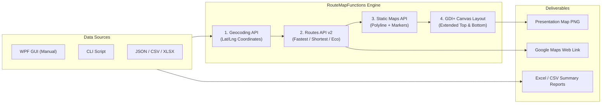

# Google Maps Routes & Map Generator v2.0

An enterprise-grade, universal PowerShell and WPF application for multi-stop vehicle route calculation, multi-criteria optimization (**Fastest**, **Shortest**, **Eco / Fuel-Efficient**), and presentation-ready PNG map generation powered by **Google Maps Platform** (Routes API v2, Geocoding API, and Maps Static API).

---

## Key Features

### 1. Multi-Stop Route Optimization (Routes API v2)
- **Origin & Destination**: Geocoded with full street address validation.
- **Waypoints**: Up to 25 intermediate stops with interactive reordering (Move Up / Move Down).
- **Optimization Modes**:
  - ⚡ **Fastest (`Fastest`)**: Minimizes travel time with optional live traffic awareness (`TRAFFIC_AWARE`).
  - 📏 **Shortest (`Shortest`)**: Minimizes physical distance (km) by analyzing Google route alternatives (`TRAFFIC_UNAWARE`).
  - 🌿 **Eco / Fuel-Efficient (`Eco`)**: Minimizes fuel consumption and CO₂ emissions tailored to vehicle engine type (`GASOLINE`, `DIESEL`, `HYBRID`, `ELECTRIC`).

### 2. Zero-Occlusion Extended Map Canvas (GDI+)
- **No Map Overlays**: Unlike standard static map tools that stamp text over map tiles, our custom GDI+ rendering engine **extends the canvas vertically**:
  - **Top Banner (38px)**: Route title/description on the left, localized route type badge (`Typ: Najkrótsza`, `Type: Shortest`, `Typ: Kürzeste`) in yellow on the right.
  - **Unobstructed Map**: 100% visible Google map tiles with full road geometry, markers (`A`, `1..N`, `B`), and encoded polyline.
  - **Bottom Banner**: Origin [A] in green, Destination [B] in red, with total distance and duration placed **a line lower** so multi-line wrapped addresses never collide with metrics.

### 3. Multi-Language Support (EN / DE / PL) & External Schema
- **Dynamic UI Localization**: Switch between **English**, **Deutsch**, and **Polski** at runtime via the header dropdown (`[PL] Polski`).
- **External Configuration (`localization.json`)**: Add new languages (e.g. `FR`, `ES`, `IT`) without modifying source code or recompiling.
- **Google Maps API Integration**: API requests pass the selected language (`language=pl`, `languageCode: "pl"`), ensuring map tiles, exonyms, and street names match the chosen locale.

### 4. Universal Batch Processing
- **Excel (.xlsx)**: Processes tabular route files automatically. Supports common header variations:
  - `Name` / `Nazwa` / `Umowa` / `Opis`
  - `Start` / `Dom` / `Origin` / `Początek`
  - `End` / `Szkola` / `Praca` / `Destination` / `Cel` / `Koniec`
  - `Waypoints` / `PunktyPosrednie` (separated by `;` or `|`)
  - `RouteType` / `TypTrasy` (`Fastest`, `Shortest`, `Eco`)
- **CSV / TSV**: Automatic delimiter detection (semicolon, comma, tab).
- **JSON**: Supports both route lists and sequential single-trip stops.
- **Smart Folder Memory**: Remembers last-opened directory and output paths across sessions.

### 5. Production Security & Standalone Compilation
- **Windows DPAPI Credential Protection**: API keys are securely encrypted using Windows DPAPI (`DataProtectionScope.CurrentUser`) and stored in `config.json`.
- **Standalone Windows Executable**: Compile into a single, standalone executable (`GoogleMapsRoutes.exe`) using `Build-Exe.ps1` (powered by PS2EXE). Runs in Single-Threaded Apartment (`-STA`) without console windows (`-NoConsole`).

---

## Architecture



---

## Requirements

- **Operating System**: Windows 10 / Windows 11 / Windows Server 2016+
- **PowerShell**: Windows PowerShell 5.1 or PowerShell 7+ (Core)
- **PowerShell Modules**:
  - `ImportExcel` (required for Excel `.xlsx` processing)
  - `ps2exe` (optional, for compiling `.exe` executables)
- **Google Maps API Key** with the following services enabled:
  - **Routes API** (v2)
  - **Geocoding API**
  - **Maps Static API**

---

## Quick Start

### Graphical User Interface (GUI)
Run the script directly or launch the compiled `.exe`:
```powershell
# Run PowerShell script:
.\GoogleMapsRoutes-GUI.ps1

# Or run the standalone executable:
.\GoogleMapsRoutes.exe
```

#### Manual Route Calculation:
1. Enter **Origin (A)** and **Destination (B)** addresses.
2. (Optional) Add intermediate stops in the **Waypoints** list and organize them using ▲/▼.
3. Select route optimization: **Fastest**, **Shortest**, or **Eco**.
4. Click **🚀 CALCULATE ROUTE & DOWNLOAD MAP**.
5. View real-time distance, travel time, and the rendered map. Use **🌐 Google Maps** to open the route in your browser.

#### Batch File Processing:
1. Switch to the **📁 Batch File Processing** tab.
2. Click **📂 Browse File...** and select a `.json`, `.csv`, or `.xlsx` file (see `.\Samples`).
3. Verify the loaded routes in the DataGrid preview.
4. Click **▶ Start Processing**.
5. Generated PNG maps and summary spreadsheets are saved to your configured output folder.

---

## Command Line Interface (CLI)

For headless automation, CI/CD, or batch script pipelines, use `Invoke-GoogleMapsRoute.ps1`.

### 1. Manual Route with Intermediate Stops
```powershell
.\Invoke-GoogleMapsRoute.ps1 `
    -StartPoint "Warszawa, Plac Defilad 1" `
    -EndPoint "Kraków, Rynek Główny 1" `
    -Waypoints "Radom, Plac Konstytucji 1", "Kielce, Sienkiewicza 1" `
    -RouteType Fastest `
    -GenerateMap `
    -OpenBrowser
```

### 2. Distance-Minimizing Shortest Route
```powershell
.\Invoke-GoogleMapsRoute.ps1 `
    -StartPoint "Gdańsk, Długa 1" `
    -EndPoint "Toruń, Rynek Staromiejski 1" `
    -RouteType Shortest `
    -GenerateMap
```

### 3. Fuel-Efficient Eco Route with Hybrid Engine
```powershell
.\Invoke-GoogleMapsRoute.ps1 `
    -StartPoint "Poznań, Stary Rynek 1" `
    -EndPoint "Wrocław, Rynek 1" `
    -RouteType Eco `
    -EmissionType HYBRID `
    -GenerateMap
```

### 4. Batch File Processing
```powershell
# Process Excel file and export all reports:
.\Invoke-GoogleMapsRoute.ps1 `
    -InputFile ".\Samples
outes_sample.xlsx" `
    -ExportFormat All `
    -OutputFolder ".\Results"
```

---

## Compilation to Standalone Executable (.EXE)

The project includes an automated PS2EXE compilation script: [`Build-Exe.ps1`](file:///D:/Skrypty/GoogleMapsRoutes/Build-Exe.ps1).

```powershell
# Compile universal GoogleMapsRoutes.exe:
.\Build-Exe.ps1 -Target GoogleMapsRoutes

# Compile dedicated SchoolTransportRoutes.exe:
.\Build-Exe.ps1 -Target SchoolTransportRoutes
```

### Compilation Features:
- Automatically installs `ps2exe` from PSGallery if missing.
- Terminates any running instances of the target `.exe` prior to compilation to prevent file lock errors.
- Packages all XAML templates, styles, and functions into a single binary.
- Configures `-NoConsole` and Single-Threaded Apartment (`-STA`) for smooth WPF execution.

---

## Project Structure

| File / Directory | Description |
| :--- | :--- |
| [`GoogleMapsRoutes-GUI.ps1`](file:///D:/Skrypty/GoogleMapsRoutes/GoogleMapsRoutes-GUI.ps1) | Primary WPF Dark Mode application (Manual & Batch processing). |
| [`GoogleMapsRoutes.exe`](file:///D:/Skrypty/GoogleMapsRoutes/GoogleMapsRoutes.exe) | Compiled standalone executable (universal routing). |
| [`Build-Exe.ps1`](file:///D:/Skrypty/GoogleMapsRoutes/Build-Exe.ps1) | PS2EXE build script for compiling standalone executables. |
| [`RouteMapFunctions.ps1`](file:///D:/Skrypty/GoogleMapsRoutes/RouteMapFunctions.ps1) | Shared core engine module (Geocoding, Routes v2, Static Maps, GDI+ canvas). |
| [`Invoke-GoogleMapsRoute.ps1`](file:///D:/Skrypty/GoogleMapsRoutes/Invoke-GoogleMapsRoute.ps1) | Full-featured CLI automation script. |
| [`Process-SchoolTransportRoutes-GUI.ps1`](file:///D:/Skrypty/GoogleMapsRoutes/Process-SchoolTransportRoutes-GUI.ps1) | Dedicated school transport contract processing GUI. |
| [`SchoolTransportRoutes.exe`](file:///D:/Skrypty/GoogleMapsRoutes/SchoolTransportRoutes.exe) | Compiled standalone executable for school transport processing. |
| [`localization.json`](file:///D:/Skrypty/GoogleMapsRoutes/localization.json) | External multi-language dictionary (English, Deutsch, Polski). |
| [`Samples/`](file:///D:/Skrypty/GoogleMapsRoutes/Samples) | Sample input files (`routes_sample.json`, `routes_sample.csv`, `routes_sample.xlsx`, `multipoint_trip_sample.json`). |
| [`.agents/skills/google-maps-routes-api/`](file:///D:/Skrypty/.agents/skills/google-maps-routes-api) | AI agent skill specification, API references, and code patterns. |

---

## File Encoding Standards

In accordance with project guidelines, all source files (`.ps1`, `.psm1`), configuration files (`.json`), and documentation (`.md`) are strictly encoded in **UTF-8 with BOM** (`0xEF, 0xBB, 0xBF`).
